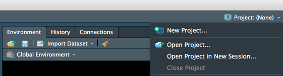
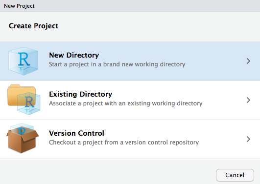
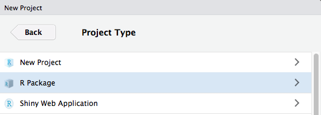
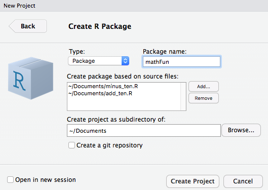
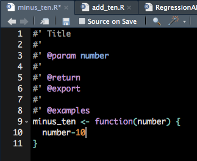

```{r setup, include=FALSE}
options(htmltools.dir.version = FALSE)
```

class: title-slide, left, middle

# Make an R Package! 📦 

<br>


<h3> Katherine Simeon </h3>  

<br>
<h3> Northwestern R User Group <br> March 7, 2019 </h3>  
  
<br>
`r fontawesome::fa("github")` [github.com/katherinesimeon/make-r-packages](https://github.com/katherinesimeon)  

    
---
  
# Acknowledgments  
  
<br><br><br>
    
    
  
  
Stephanie Kirmer's [R Package Tutorial](https://github.com/skirmer/r_packages)   
  
Hadley Wickham's book, [R Packages](http://r-pkgs.had.co.nz/)  
  
---
  
# Why packages?  
  
A package is a **fundamental**, **reproducible**, and **shareable** unit of R code.  
  
<br>
  
--
  
When we create a package, we...  
  
* **Generalize** our code to be used for other purposes.    
* **Document** code to effectively communicate processes to our future selves & others.  
* Enable code to be **shared** easily with others.  
  
---

# Our Objective  
  
To demonstrate the basics of creating a package in R.  
 
--
  
.pull-left[
## What we'll do:   
  
1. Set up an `.RProj` file to be made into a package.    
2. Document the functions.  
3. Compile documentation & install our package.  
]
  
--
  
.pull-right[
## What we need:  
  
1. Function(s) you want in your package.  
2. Packages `devtools` and `roxygen2`   
]
  
  
  
---
    
# First steps  
  
**1.** Install the 📦s used to make a 📦  
  
```{r eval=FALSE}
install.packages(“devtools”) # Install
install.packages(“roxygen2”)

library(devtools) # Load
library(roxygen2)
```
  
<br>
  
**2.** Put all the functions you want in your package into a single directory. 
  
---
  
# Make an R project  
    
Then, we'll create a project:  
    
.center[  ]  
  
--
  
.pull-left[
 
]
  
--
  
.pull-right[
   
]
  
---
  
# Package Set Up  
  
  
.pull-left[
  
1. Name your package.  
2. Indicate what files you want in your package (these files should be in a single directory).    
3. Create your project as a subdirectory in the same location as the aforementioned files.
]
  
  
.pull-right[
   
]
  
---
  
# From the command line  
    

  
<br>  
  
Use `usethis` - a [package](https://github.com/r-lib/usethis) that automates repetitive tasks in project development:  
```{r, eval=FALSE} 
usethis::create_package("packagename")
```
   
---
  
# We have a package!  
  
```{r, eval=FALSE}  
aPACKAGE  
    |
    ├── DESCRIPTION        
    |                       
    ├── NAMESPACE
    |
    ├── R/                    
    │   ├── Function1.R       
    │   └── Function2.R   
    |
    ├── man/                   
    │   ├── Function1.Rd       
    │   └── Function2.Rd 
    |
    └── A_package.Rproj    
```
  
---
  
# We have a package!  
  
```{r, eval=FALSE}  
aPACKAGE  
    |
    ├── DESCRIPTION         #<< 
    |                       
    ├── NAMESPACE
    |
    ├── R/                    
    │   ├── Function1.R       
    │   └── Function2.R   
    |
    ├── man/                   
    │   ├── Function1.Rd       
    │   └── Function2.Rd 
    |
    └── A_package.Rproj     
```
  
---
  
# We have a package!
  
```{r, eval=FALSE}  
aPACKAGE  
    |
    ├── DESCRIPTION         # Important metadata!  
    |                       
    ├── NAMESPACE           #<<
    |
    ├── R/                    
    │   ├── Function1.R       
    │   └── Function2.R   
    |
    ├── man/                   
    │   ├── Function1.Rd       
    │   └── Function2.Rd 
    |
    └── A_package.Rproj    
```
  
---
  
# We have a package!  
  
```{r, eval=FALSE}  
aPACKAGE  
    |
    ├── DESCRIPTION         # Important metadata!  
    |                       
    ├── NAMESPACE           # Specifies functions used in package
    |
    ├── R/                    #<<
    │   ├── Function1.R       
    │   └── Function2.R   
    |
    ├── man/                   
    │   ├── Function1.Rd       
    │   └── Function2.Rd 
    |
    └── A_package.Rproj    
```
  
---
  
# We have a package!  
  
```{r, eval=FALSE}  
aPACKAGE  
    |
    ├── DESCRIPTION         # Important metadata! 
    |                       
    ├── NAMESPACE           # Specifies functions used in package
    |
    ├── R/                    # Functions that are in your package
    │   ├── Function1.R       
    │   └── Function2.R   
    |
    ├── man/                   #<<
    │   ├── Function1.Rd       
    │   └── Function2.Rd 
    |
    └── A_package.Rproj     
```
  
---
  
# We have a package!  
  
```{r, eval=FALSE}  
aPACKAGE  
    |
    ├── DESCRIPTION         # Important metadata! 
    |                        
    ├── NAMESPACE           # Specifies functions used in package
    |
    ├── R/                    # Functions that are in your package
    │   ├── Function1.R       
    │   └── Function2.R   
    |
    ├── man/                   # Documentation for functions
    │   ├── Function1.Rd       
    │   └── Function2.Rd 
    |
    └── A_package.Rproj     #<< 
```
  
---
  
# We have a package!  
  
```{r, eval=FALSE}  
aPACKAGE  
    |
    ├── DESCRIPTION         # Important metadata! 
    |                        
    ├── NAMESPACE           # Specifies functions used in package
    |
    ├── R/                    # Functions that are in your package
    │   ├── Function1.R       
    │   └── Function2.R   
    |
    ├── man/                   # Documentation for functions
    │   ├── Function1.Rd       
    │   └── Function2.Rd 
    |
    └── A_package.Rproj     # R project file you created for your package
```
  
---
  
# Documentation  
  
.pull-left[
1. Open a function script.  
2. Place your cursor inside the function's curley brackets `{}`  
3. In top dropdown menu:  
  + Click **Code**  
  + Select **Insert Roxygen Skeleton**   
  
]
   
--
  
.pull-right[
Fill this out:  
  
   
]

   
---
  
# Roxygen Skeleton  
  
```{r, eval=FALSE}
#' Minus Ten  
#'  
#' Subtract 10 from a given number
#'
#' @param number a number
#'
#' @return a number that is the provided number minus 10
#' @export
#'
#' @examples
#' minus_ten(22) will return 12
minus_ten <- function(number) {
  number-10
}
```
  
<br>
  
.right[Learn more at http://r-pkgs.had.co.nz/man.html]
  
  
---
  
# Make your package!   
  
1. Make sure the working directory is the main package folder.  
  
--
  
2. Render your documentation: `devtools::document()`  
  + This should create `.Rd` files in the `man` folder.  
  
--
  
3. Install your package: `devtools::install()`  
  
  
--
  
<br>
  
.right[*These are also the steps for updating your package later on!*]    
  
  
---
  
# Sharing your package  
  
<br>
  
1. `devtools::install()` with the package folder on the local computer.  
  
2. `devtools::install_github("USERNAME/REPO_NAME")` with the package directory as a GitHub repo.    
   
   
---
    
# Unit Testing  
    

  
<br>  
  
The `testthat` [package](https://github.com/r-lib/testthat) has functions that help create unit tests.  
  
In the main directory of your package, use `usethis`  

```{r, eval=FALSE} 
usethis::use_test("functionname") # Create your test

devtools::test() # Runs the test you've made.
```
  
--
  
<br>
  
This will create a test folder with an R script to write your unit test.  
  
Use `devtools` to run your tests.  
  
  
---
  
# Add dataset to a package  
  
Data is an `.RData` file in a folder labelled, "data" in your package.  
  
Load your data into your working directory and save it:  
  
```{r, eval=FALSE}
save(mydata,file="data/mydata.RData") 
```
   
   
Add a `data.R` file that has documentation of your dataset (with roxygen comments).  
